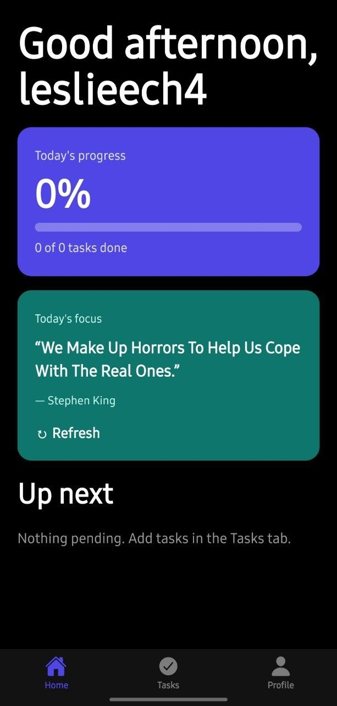
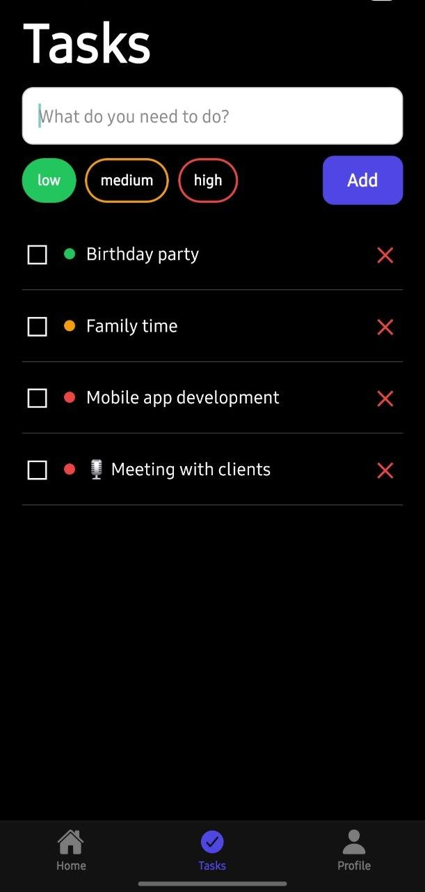
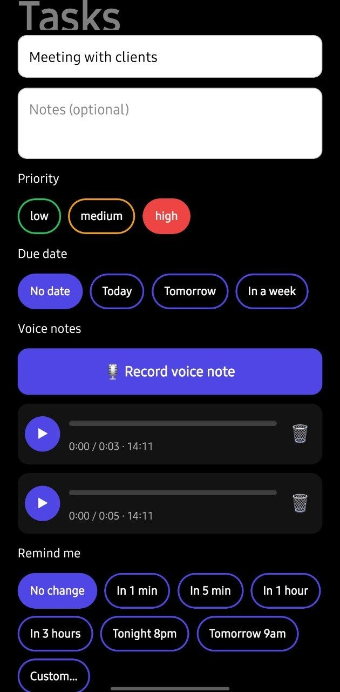
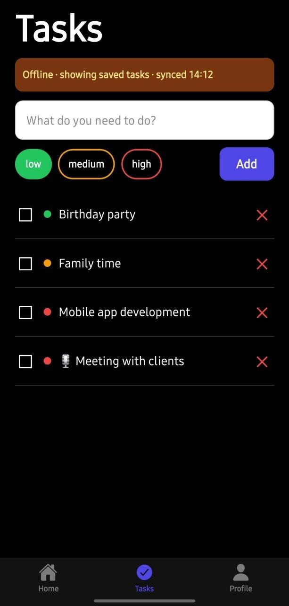

# LifeFlow 📱

A cross-platform task manager with voice notes, reminders and offline access.
Built with React Native, Expo and TypeScript, with a Supabase backend.

## Features
- Email sign-up and login (Supabase Auth)
- Tasks: create, edit, complete and delete, with priority and due date
- Home dashboard: progress, overdue count, next tasks
- Voice notes: record, play, pause, seek and delete multiple notes per task
- Reminders with preset or custom times (scheduled local notifications)
- Offline mode: cached tasks with a "last synced" banner
- Focus quote loaded from a public REST API
- Premium screen (UI demo only, no real payments)

## Tech stack
React Native · Expo (SDK 57) · TypeScript · Expo Router · Supabase (Auth,
Postgres, Storage) · AsyncStorage · expo-notifications · expo-audio · EAS Build

## How it works
- Each user's data is protected with Postgres Row Level Security.
- Voice recordings are stored in a private bucket, one folder per user,
  and played from temporary signed URLs.
- Tasks are cached in AsyncStorage. If the network request fails, the
  cached list is shown.

## Screenshots
| Home | Tasks | Voice notes | Offline |
|---|---|---|---|
|  |  |  |  | | 

## Run it locally
```bash
git clone https://github.com/arsema-hm/lifeflow.git
cd lifeflow
npm install
```
Create a `.env` file:
```
EXPO_PUBLIC_SUPABASE_URL=your-project-url
EXPO_PUBLIC_SUPABASE_ANON_KEY=your-publishable-key
```
Then run `npx expo start` and scan the QR code with Expo Go.
Reminders need a development or release build, because Expo Go on Android
does not support notifications.

## Build for Android
```bash
eas build --platform android --profile preview
```

## Platform notes
- Tested on a physical Android phone (APK built with EAS Build).
- The code targets iOS too. I develop on Windows, so iOS builds would go
  through EAS cloud builds or a Mac with Xcode. iOS is untested.
- Not published to the stores yet.

## Known limitations
- Offline mode is read-only. Edits are not queued for sync.
- Reminders are local notifications, not remote push.
- Premium is a UI placeholder. No billing is integrated.

## Author
Arsema Hailemariyam Worku